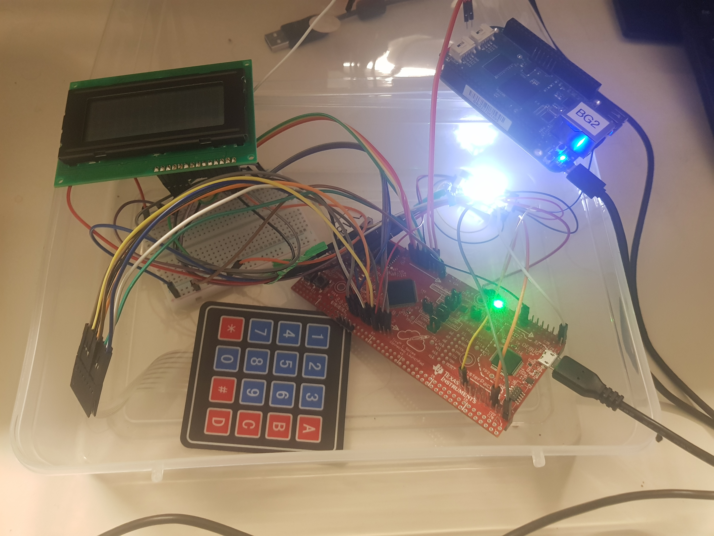

# Two-Factor-Authentication-System
# Author: Siddhant Jajoo and Satya Mehta  

  
 
This project was completed in the course Advanced Embedded Software Development at University of Colorado, Boulder under the guidance of professor Richard Heiderbecht in April 2019.  

## Hardware Components:
- Beaglebone Green (Control Node)
- Tiva C Series TM4C1294XL (Remote Node)
- Fingerprint Sensor (GT-521F32) [Click here](https://www.sparkfun.com/products/14518)
- 4x4 Matrix Keypad [Click here](https://www.amazon.com/Matrix-Membrane-Switch-connector-Arduino/dp/B01FDEIT0U/ref=sr_1_5?keywords=matrix+keypad&qid=1558600446&s=gateway&sr=8-5)
- Buzzer [Click here](https://www.sparkfun.com/products/7950)
- LCD Hitachi HD44780 
- UART
- NRF24L01+

## Software Components:
- TIVA + FreeRTOS
- BBG + Linux
- Multithreading, Heartbeat, BIST, Timers
- Log Level and Error Checking/Handling
- Inter Process Communication (IPC)
- Mutexes, Signal Handlers
- Python Scripts - SMTP library and PyQT library

## Features:
- Creates a secure lock for appropriate applications. Example-Bank Lockers.
- Two Factor Authentication System using Fingerprint sensor and a Keypad to enter OTP.
- System consists of a central node as a server.
- System consists of a remote node for different lockers consisiting of sensors and actuators.
- Communication achieved between Control Node and Remote Node using UART and NRF24L01+.
- Implemented proper packet structure with handling packet loss mechanism.
- Implemented Fail Safe Mechanism and Error Checking/Handling Capabilities.
- Fault Tolerant system with degraded functionality in absence of fingerprint sensor.
- Remote Logging with different Log levels - INFO, DEBUG, ERROR.
- OTP calculaion and verification done on the COntrol Node.
- LCD displays all the required messages.
- Buzzer is sound when an unauthorized person tries to access.
- GUI to control Buzzer and Fingerprint sensor functionalities.
- Signal Handler for safe exit.

## Block Diagram:

## Overview:
The aim of this project is to have a secure locking system to a highly confidential resource, for example: Bank Lockers. This is implemented in the form of Two Factor Authentication System. This is achieved with the help of a TIVA board and a BBG board. The TIVA board acts as the remote node and the BBG board acts as the control node. The control node is responsible for processing and making all the real-time decisions based on values/data received from the TIVA board. The TIVA + FreeRTOS is integrated with different sensors and input devices to obtain values as per the application. The control node and remote node will function in a closed loop. The Control node will drive the outputs of the Remote Node in the form of actuators. The communication between the two boards can be wired or wireless.  
The Sensors integrated on the Remote Node are:
- Keypad.
- Fingerprint sensor-GT521F32.  

Actuators used on the Remote Node are:
- Buzzer
- LCD  

The communication used between the boards is:
- UART (Primary Mode of Communication)
- NRF24L01+ (Still under progress)

Two communication methods have been used to provide fail-safe communication. If any one mode of communication fails, the system should switch to the other mode of communication and complete the required task.

We have designed and would be demonstrating the prototype of the above application in this report with a single Control Node and Remote Node. The remote node will wait for a valid fingerprint to be detected using interrupts. If a fingerprint is valid, it will send a packet to the remote node specifying the ID of the matched fingerprint otherwise it would send a “not matched” packet to the control node. Every Packet send will be responded with an acknowledgement by both the nodes. On receiving the packet specifying if the fingerprint is matched, the control node would respond with an OTP which would be required by the user to input via keypad. The messages for the steps to be executed would be continuously displayed on the LCD attached on the Remote Node. The entered OTP is verified with the OTP stored in the Control Node. If the OTP matches, then Access is granted otherwise buzzer is sound. All the data is logged into a text file on the Control Node. This includes all the messages of the Remote Node sent to the Control Node as well. In addition to this, A GUI has been designed on the Control Node having the following buttons:
1. Buzzer off: Switches the Buzzer off.
2. Buzzer on: Switches the Buzzer on.
3. Delete all: Deletes all the registered fingerprints.
4. Add fingerprint: Starts the routine to add a fingerprint on the Remote Node.
5. Reset: Resets the Remote Node to the starting point.

## GUI:

## Basic Communication Flow:

The Entire Project Report can be found [here]().

The Entire Code Documentation can be found [here]().
